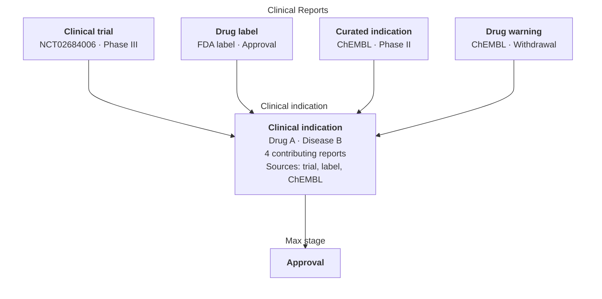

# Clinical Indication

A Clinical Indication represents one drug–disease relationship supported by one or more Clinical Reports. It brings evidence from different records into a compact view while preserving links back to every supporting report.

This is the dataset Open Targets uses to show the diseases for which a drug has clinical evidence. See the [Open Targets Indications documentation](https://platform-docs.opentargets.org/drug/indications) for its presentation in the Platform.

## From reports to an indication

Mira starts with individual [Clinical Reports](clinical-report.md). Each report can contain one or more drugs and diseases. Mira forms the drug–disease pairs described by those reports, then groups matching pairs into Clinical Indications.

The example below shows two trial reports supporting the same relationship:



The diagram shows how reports from different origins can support the same drug–disease relationship. The Clinical Indication consolidates them and summarises the maximum stage while retaining the contributing report IDs.

## Mapping status

Drug and disease identifiers are assigned while [Clinical Reports are prepared](entity-mapping.md). A Clinical Indication records how complete that mapping is:

| Mapping status | Drug ID | Disease ID |
| --- | --- | --- |
| `FULLY_MAPPED` | Known | Known |
| `DRUG_MAPPED` | Known | Missing |
| `DISEASE_MAPPED` | Missing | Known |
| `UNMAPPED` | Missing | Missing |

> [!NOTE]
> Mira keeps partially mapped and unmapped indications so users can inspect coverage and improve mappings. The Open Targets Platform displays an indication only when both identifiers are known: in Mira, these records have `mappingStatus: FULLY_MAPPED`.

> [!IMPORTANT]
> When an identifier is available, `drugName` or `diseaseName` contains that identifier. When mapping is unavailable, it falls back to the source label. These fields therefore act as the grouping keys for the relationship; despite their names, they do not always contain human-readable names.

## Maximum clinical stage

`maxClinicalStage` describes the most advanced clinical-development or regulatory stage found across the reports supporting an indication. Mira uses the shared stage ordering described in [Clinical Report: Clinical stage](clinical-report.md#clinical-stage).

> [!NOTE]
> During current Clinical Indication generation, reports at `WITHDRAWAL`, `PHASE_4`, or `APPROVAL` are represented as `APPROVAL` before the maximum is selected. The remaining categories follow the clinical-stage order from preapproval through preclinical and unknown.

The maximum stage summarises how far the drug–disease relationship has progressed. Use `clinicalReportIds` to inspect the underlying evidence and understand which records produced it.

## Core fields

The core schema is defined in [`schemas.py`](https://github.com/opentargets/mira/blob/main/src/mira/schemas.py). See the [Open Targets Clinical Indication schema](https://platform.opentargets.org/downloads/clinical_indication/schema) for the full downloadable dataset contract.

| Field | Meaning |
| --- | --- |
| `id` | Identifier derived from the drug and disease grouping keys. |
| `drugName` | Mapped ChEMBL ID when available; otherwise the drug label from the source. |
| `diseaseName` | Mapped EFO ID when available; otherwise the disease label from the source. |
| `drugId` | Mapped ChEMBL identifier, or null when the drug is not mapped. |
| `diseaseId` | Mapped EFO identifier, or null when the disease is not mapped. |
| `maxClinicalStage` | Most advanced clinical stage across the supporting reports. |
| `mappingStatus` | Whether the drug, disease, both, or neither have mapped identifiers. |
| `clinicalReportIds` | Identifiers of all Clinical Reports supporting the relationship. |

## Example

```python
{
    "id": "d91e8ed89d3480f88ff6e4d7389427bd177ce3826dd77d3d174a76919b679ac1",
    "drugName": "CHEMBL1009",
    "diseaseName": "EFO_0004270",
    "maxClinicalStage": "PHASE_3",
    "mappingStatus": "FULLY_MAPPED",
    "clinicalReportIds": ["nct00144209", "nct00625547"],
    "diseaseId": "EFO_0004270",
    "drugId": "CHEMBL1009",
}
```

This record tells us that:

- the drug and disease have both been mapped, so the relationship can be displayed in Open Targets;
- `drugName` and `diseaseName` use the mapped identifiers;
- Phase III is the most advanced stage among the supporting reports;
- two Clinical Reports support the relationship and can be retrieved through their IDs.

## Trace an indication to its reports

`clinicalReportIds` keeps the aggregated relationship connected to its evidence. For example, to find indications supported by a particular report:

```python
import polars as pl


clinical_indications.filter(
    pl.col("clinicalReportIds").list.contains("nct00144209")
)
```

The corresponding Clinical Reports contain the provider, source, URL, source-specific metadata, and drug and disease labels used to build the indication.
