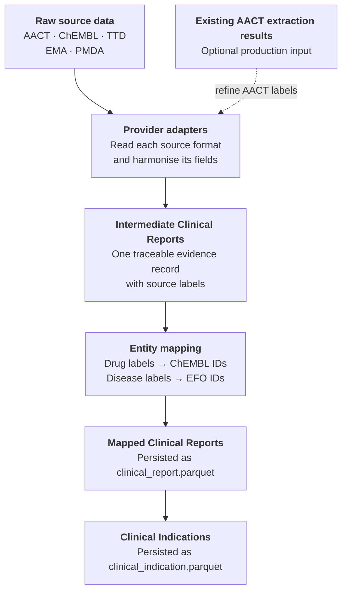

# How Mira works

Mira turns records from several clinical-data providers into two related datasets:

- **Clinical Reports** preserve individual pieces of evidence in a shared format.
- **Clinical Indications** summarise the drug–disease relationships supported by those reports.

Between the two, Mira maps source labels to the identifiers used by Open Targets. Drug labels are mapped to ChEMBL identifiers and disease labels to Experimental Factor Ontology (EFO) identifiers.

## The data flow

This flow separates source-specific work from shared domain rules. Provider adapters understand the shape of AACT, ChEMBL, TTD, EMA, and PMDA data. The report, mapping, and indication stages apply the same concepts after those differences have been harmonised.

## 1. Read records from providers

A **source** is where a piece of evidence originated. A **provider** is the resource from which Mira obtained it. For example, ClinicalTrials.gov is the source of a study that Mira reads through the AACT provider. ChEMBL can also provide records and references originating from other sources.

Each provider adapter reads its own tables or files and translates them into the common Clinical Report structure. This is where source-specific column names, stage values, URLs, and metadata are interpreted.

The [data-input inventory](data-inputs.md) lists the upstream datasets and their expected formats. Provider pages, such as the [AACT guide](providers/aact.md), explain how a particular source becomes Clinical Reports.

## 2. Create Clinical Reports

A [Clinical Report](clinical-report.md) is one traceable evidence record. Depending on its source, it can represent a clinical trial, a medicine label, a regulatory record, a curated indication, or a safety warning.

Every report uses the same small core model: its identifier, source, provider, origin, evidence type, clinical stage, drugs, diseases or safety outcomes, and a link to the underlying evidence. Providers can retain additional fields, such as clinical-trial metadata, alongside that core.

> [!IMPORTANT]
> A report may contain several drugs or diseases. It expresses that the entities occur in the same evidence record; by itself, it does not establish that a treatment was effective or that every possible drug–disease combination has the same role.

### LLM-assisted extraction for AACT

AACT provides structured intervention and condition fields, but those fields do not always describe the role each entity plays in a trial. Mira can use previously generated large language model (LLM) extraction results to identify more specific drug and disease mentions from the trial text before creating AACT Clinical Reports.

This is an optional refinement of the AACT provider path. The extraction results can replace the original intervention and condition labels used to generate reports; they are not a mapping system and do not assign ChEMBL or EFO identifiers. Entity mapping still happens later through the shared mapping stage.

> [!WARNING]
> Extraction coverage matters. When extraction results cover only part of the selected AACT data, records without extracted labels can lose the entities needed for report generation. A production run should therefore treat the extraction set as a versioned input and measure its coverage against the selected studies.

The current documentation explains this integration point at a conceptual level. Detailed guidance for generating extraction results, choosing prompts and models, and operating the extraction recipe remains deferred.

## 3. Map drugs and diseases

Source labels vary in spelling, specificity, and structure. [Entity mapping](entity-mapping.md) keeps those labels and adds stable identifiers where possible:

- `drugFromSource` is mapped to `drugId`, using the Open Targets ChEMBL-based molecule dictionary;
- `diseaseFromSource` is mapped to `diseaseId`, using the Open Targets EFO-based disease index.

Mapping happens on Clinical Reports so the original evidence and its mapped entities remain together. The drug and disease paths differ, and named-entity recognition (NER) can extract cleaner entity mentions from labels that did not map directly. Mapping can still fail for either entity; Mira preserves these records for inspection.

Some providers already supply identifiers. Mira retains those mappings and uses the shared mapping stage to fill remaining gaps.

## 4. Aggregate Clinical Indications

A [Clinical Indication](clinical-indication.md) groups the reports supporting one drug–disease relationship. It records:

- the mapped identifiers, when available;
- the relationship's mapping status;
- the maximum clinical stage found across its supporting reports;
- `clinicalReportIds`, which trace the result back to the evidence.

When a report contains several drugs and diseases, indication generation forms the drug–disease pairs represented by those lists. Users should inspect the supporting reports when the role or meaning of a pair matters.

Mira retains fully mapped, partially mapped, and unmapped indications. Open Targets displays the fully mapped subset, where both the ChEMBL drug identifier and EFO disease identifier are known.

## Data concepts and execution tools

The same data flow can be run through two interfaces. The interface changes how the steps are assembled, not what a Clinical Report or Clinical Indication means.

| If you want to understand… | Start here |
| --- | --- |
| What one evidence record means | [Clinical Report](clinical-report.md) |
| How drug–disease evidence is aggregated | [Clinical Indication](clinical-indication.md) |
| How source labels become controlled identifiers | [Entity mapping](entity-mapping.md) |
| Which upstream datasets Mira consumes | [Data inputs](data-inputs.md) |
| How a provider interprets its source data | [AACT](providers/aact.md), [ChEMBL](providers/chembl.md), [TTD](providers/ttd.md), [EMA](providers/ema.md), and [PMDA](providers/pmda.md) provider guides |
| How to call provider, mapping, and aggregation functions directly | [Generate data with Python](generate-with-python.md) |
| How to compose the same steps as a repeatable recipe | [CLI and YAML configuration](cli-and-configuration.md) |

The **data documentation** explains what records mean, how they relate, and how to interpret their fields. The **execution documentation** explains how Python calls and YAML recipes produce those records. Implementation links are included where maintainers need to trace or extend the behavior.

## The default Open Targets workflow

The complete packaged recipe reads AACT and ChEMBL databases, TTD text data, the EMA workbook, the PMDA approvals PDF, and the Open Targets disease and molecule indices. It then:

1. prepares provider-specific inputs;
2. generates reports for each provider;
3. combines the reports;
4. maps drug and disease entities;
5. writes `clinical_report.parquet`;
6. derives and writes `clinical_indication.parquet`.

The workflow can also consume the previously generated AACT extraction results described above. They should be treated as an additional production input whose coverage can affect which AACT reports are generated.

> [!NOTE]
> The private Oracle clinical-trial mapping is a legacy internal input intended for deprecation. Public and new workflows can omit it and use the standard mapping path.

See [CLI and YAML configuration](cli-and-configuration.md#run-the-complete-open-targets-workflow) for the executable workflow and [Data inputs](data-inputs.md) for its prerequisites.

## What the outputs do and do not say

Clinical Reports describe evidence records, and Clinical Indications summarise the relationships found in them. They support provenance, integration, and analysis across heterogeneous sources.

> [!IMPORTANT]
> Neither dataset is a conclusion about treatment efficacy. Clinical stage describes development or regulatory status, while an indication's maximum stage summarises the most advanced supporting report. The report IDs and source fields remain essential when interpreting why a relationship exists.

## Choose a route

- To learn the data model, continue with [Clinical Report](clinical-report.md), then [Clinical Indication](clinical-indication.md).
- To see each function boundary, use [Generate data with Python](generate-with-python.md).
- To run a repeatable configured workflow, use [CLI and YAML configuration](cli-and-configuration.md).
- To prepare a production-like run, review [Data inputs](data-inputs.md) and [Entity mapping](entity-mapping.md) first.
