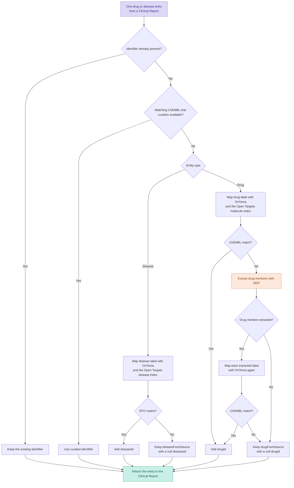
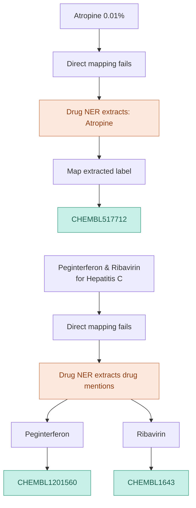

# Entity mapping

Clinical data uses many names for the same drug or disease. It can also place a useful name inside a longer phrase, such as a formulation, treatment arm, or therapeutic indication. Mira maps those source values to the identifiers used across Open Targets:

- drugs map to the ChEMBL molecule dictionary;
- diseases map to the Experimental Factor Ontology (EFO).

Mapping happens while Clinical Reports are prepared. The source text remains in `drugFromSource` or `diseaseFromSource`, and a successful mapping adds `drugId` or `diseaseId`. This keeps the original evidence visible while giving downstream datasets stable identifiers.

Mira uses [Open Targets OnToma](https://github.com/opentargets/OnToma) for label mapping and named-entity recognition (NER). OnToma builds the label lookup tables from the Open Targets molecule and disease indices supplied to the pipeline.

## The mapping flow

Mira preserves identifiers already supplied by a provider. For missing identifiers, it can first use ChEMBL clinical-trial curation and then runs OnToma label mapping. Drug labels get an additional NER retry when direct mapping fails. Disease NER currently happens earlier in the providers that need to extract disease names from free text.



The curation and label-mapping steps are independent for drugs and diseases. A report can therefore finish with both identifiers, only one identifier, or neither identifier.

## Existing identifiers

Some provider outputs already contain a `drugId` or `diseaseId`. Mira treats that identifier as resolved and does not replace it with a later result. This rule also applies when a report has one mapped entity and one unresolved entity: only the missing side enters the mapping flow.

## ChEMBL clinical-trial curation

Mira can use the ChEMBL curation of clinical trials before general label mapping. This is especially useful when a label is ambiguous without its study context.

The optional curation input contains:

| Field | Meaning |
| --- | --- |
| `studyId` | Clinical trial identifier. |
| `drugFromSource` | Intervention label as it appears in the trial. |
| `drugId` | Curated ChEMBL molecule identifier. |
| `diseaseFromSource` | Condition label as it appears in the trial. |
| `diseaseId` | Curated EFO identifier. |

Mira joins this data using the study ID and the corresponding source label. For this join, it trims leading and trailing whitespace, collapses repeated whitespace, and compares values without regard to case. Existing identifiers still take precedence.

A curated key can contain more than one drug or disease identifier. Mira retains all unique identifiers and expands the report internally so that each mapping can be represented before the nested `drugs` and `diseases` fields are rebuilt.

> [!WARNING]
> The current extraction helper is [`extract_chembl_ct_curation`](../src/mira/provider/chembl/curation.py). It reads private ChEMBL Oracle curation and produces the five-column input above. This is a legacy internal process intended for deprecation. Public and new workflows should omit `chembl_curation` and continue with OnToma mapping.

## Direct label mapping

After existing and curated identifiers have been handled, Mira collects each unique unresolved label and assigns an entity type:

- `CD` for a drug;
- `DS` for a disease.

OnToma maps the disease labels against a lookup table built from the Open Targets disease index. It maps drug labels against a lookup table built from the Open Targets molecule index. Mira then joins the resulting identifiers back to every report containing the original label.

> [!IMPORTANT]
> One label can map to several identifiers. Mira retains those mappings rather than selecting one silently. A one-to-many result should be treated as mapping ambiguity and inspected when precision matters. It can increase the number of drug–disease combinations represented in a report.

## Drug NER fallback

Direct label mapping works best when a source value is already a recognisable drug name. Trial intervention values often contain doses, formulations, combinations, or descriptive text. When `ner_extract_drug=True`, Mira applies drug NER only to labels that did not map directly.

The NER step combines the regex, BioBERT, and DrugTemist extractors provided by OnToma. Its output is a set of cleaner drug mentions. Mira maps those extracted labels through OnToma again and associates every successful ChEMBL identifier with the original source label.

For example:



> [!NOTE]
> NER does not assign a ChEMBL identifier itself. It extracts candidate names, and the second OnToma lookup provides the identifier. If extraction or the second lookup fails, the original label remains available with a null `drugId`.

### Cache drug NER results

Drug NER can be computationally expensive. Set `ner_cache_path` to reuse extracted mentions for labels processed in an earlier run:

```python
mapped_reports = ClinicalReport.map_entities(
    spark=spark,
    reports=all_reports,
    disease_index=disease_index,
    drug_index=molecule_index,
    ner_extract_drug=True,
    ner_batch_size=256,
    ner_cache_path=".cache/ner/ner_cache.parquet",
)
```

> [!TIP]
> The cache is keyed by the original `query_label`. Use a stable path for repeatable runs. Rebuild it when the NER models or extraction settings change and you need results produced by the new setup.

Set `ner_extract_drug=False` to stop after direct label mapping. This is useful for a quicker run or an environment where the NER dependencies are unavailable.

## Disease extraction and mapping

Disease handling has two distinct stages:

1. A provider turns its structured fields or free text into `diseaseFromSource` labels.
2. The shared mapper maps those labels to EFO.

Providers such as AACT already expose condition labels. EMA and PMDA instead contain therapeutic or approval text, so their provider functions use OnToma disease NER to extract disease mentions before they create Clinical Reports. Those extracted mentions then enter the same direct EFO label-mapping step as other disease labels.

> [!NOTE]
> The shared mapping function does not currently run disease NER after a disease label fails to map. An unresolved disease therefore keeps its `diseaseFromSource` value and a null `diseaseId`.

## Why the NER paths stay entity-specific

Drug and disease NER solve different input problems in Mira. Drug NER cleans unresolved intervention labels during shared mapping. Disease NER extracts mentions from provider-specific free-text fields before mapping. Applying one generic fallback to both could change the meaning or granularity of disease records, for example by extracting several conditions from text that a provider intended as one indication.

A future refactor can encapsulate the repeated orchestration—extract candidate labels, map them, and retain provenance—behind a common interface. The extraction policy should remain entity-specific and configurable. Disease NER should only become a generic fallback after representative unmapped labels have been evaluated and the desired one-to-many behavior has been agreed.

## Interpret mapping results

Mapping is allowed to be incomplete. Always retain the source labels when inspecting failures:

```python
import polars as pl


unmapped_drugs = mapped_reports.df.filter(
    pl.col("drugs").list.eval(pl.element().struct.field("drugId").is_null()).list.any()
)

unmapped_diseases = mapped_reports.df.filter(
    pl.col("diseases")
    .list.eval(pl.element().struct.field("diseaseId").is_null())
    .list.any()
)
```

When reports are aggregated, a Clinical Indication records the outcome as `FULLY_MAPPED`, `DRUG_MAPPED`, `DISEASE_MAPPED`, or `UNMAPPED`. The Open Targets Platform displays the fully mapped subset. See [Clinical Indication: Mapping status](clinical-indication.md#mapping-status).

## Implementation reference

The public entry point is [`ClinicalReport.map_entities`](../src/mira/dataset/clinical_report.py). It expands the nested drug and disease fields, delegates mapping to [`mira.utils.mapping`](../src/mira/utils/mapping.py), and rebuilds the Clinical Report structure.

The lower-level implementation contains the curation join, OnToma lookups, drug NER fallback, and NER cache. Provider-specific disease extraction is visible in the [EMA](../src/mira/provider/ema.py) and [PMDA](../src/mira/provider/pmda.py) implementations.
