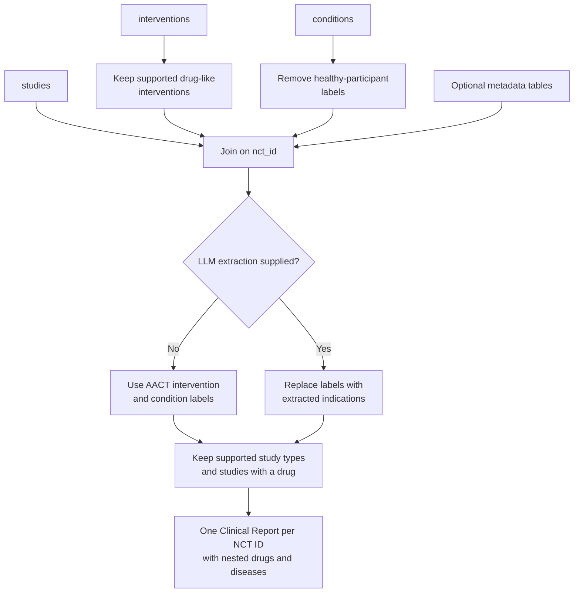

# AACT provider

AACT makes ClinicalTrials.gov study data available in a relational PostgreSQL schema. Mira reads selected AACT tables and turns each retained study into a [Clinical Report](../clinical-report.md).

This page describes the data contract and transformation. It assumes Mira can already connect to a compatible AACT database. See [AACT data inputs](../data-inputs.md#aact) for its source, snapshot policy, schema, and tables. Downloading, updating, and running that database will belong to a separate data-acquisition workflow.

## What AACT contributes

AACT is the provider: it is the resource from which Mira reads the records. ClinicalTrials.gov is the source where the evidence originated.

Every AACT report has these values:

| Clinical Report field | Value |
| --- | --- |
| `provider` | `AACT` |
| `source` | `ClinicalTrials.gov` |
| `origin` | `CLINICAL_TRIAL` |
| `type` | `INDICATION` |
| `id` | Lowercase ClinicalTrials.gov NCT identifier. |
| `url` | `https://clinicaltrials.gov/study/<NCT_ID>` |

AACT supplies the source labels for drugs and diseases. Their ChEMBL and EFO identifiers are added later by [entity mapping](../entity-mapping.md).

## Transformation at a glance



## Required tables

Three tables are required. The CLI input key normally matches the AACT table name.

### `studies`

The provider requires these columns:

| Column | Use in Mira |
| --- | --- |
| `nct_id` | Report identifier and join key. |
| `phase` | Source value used to derive `phaseFromSource` and `clinicalStage`. |
| `study_type` | Determines whether the study is retained. |

Any other selected `studies` columns become source-specific Clinical Report fields with a `trial` prefix. For example, `official_title` becomes `trialOfficialTitle` and `overall_status` becomes `trialOverallStatus`.

The default Open Targets recipe also selects:

- `overall_status`
- `start_date`
- `why_stopped`
- `number_of_arms`
- `official_title`

### `interventions`

| Column | Use in Mira |
| --- | --- |
| `nct_id` | Join key. |
| `intervention_type` | Selects drug-like interventions. |
| `name` | Becomes `drugFromSource`. |

Mira lowercases the intervention name before storing it. Identifiers are null until mapping runs.

### `conditions`

| Column | Use in Mira |
| --- | --- |
| `nct_id` | Join key. |
| `downcase_name` | Becomes `diseaseFromSource`. |

Mira lowercases this value again before storing it. Identifiers are null until mapping runs.

## Selection rules

The provider applies a small set of explicit rules before creating reports.

### Supported studies

Mira retains these `study_type` values:

- `INTERVENTIONAL`
- `OBSERVATIONAL` - these trials will have an `UNKNOWN` assigned clinical stage 
- `EXPANDED_ACCESS`

Other study types are excluded.

### Supported interventions

Mira retains these `intervention_type` values:

- `DRUG`
- `COMBINATION_PRODUCT`
- `BIOLOGICAL`

It removes an intervention when its lowercased name starts with `placebo`. Devices, procedures, behavioural interventions, and other intervention types do not become drugs in an AACT Clinical Report.

A study without a retained intervention is removed because Mira requires at least one drug label to create this report type.

### Conditions involving healthy participants

Mira removes any condition label containing the text `healthy`. This prevents labels such as `healthy volunteers` from becoming diseases.

> [!NOTE]
> The provider does not otherwise require a retained disease label. A study with a supported drug can therefore reach the Clinical Report stage with a missing disease. Such a report cannot produce a useful drug–disease relationship until a disease is available.

## Additional metadata

The `additional_metadata` parameter accepts other AACT DataFrames joined on `nct_id`. The default Open Targets recipe uses five:

| Table | Selected fields | Clinical Report result |
| --- | --- | --- |
| `study_references` | `pmid`, `reference_type` | Unique `{id, type}` entries in `trialLiterature`. |
| `designs` | `primary_purpose` | `trialPrimaryPurpose`. |
| `brief_summaries` | `description` | `trialDescription`. |
| `detailed_descriptions` | `description` | Renamed before the provider call and stored as `trialDetailedDescription`. |
| `sponsors` | `agency_class`, `lead_or_collaborator`, `name` | Lead sponsors are selected first; the first `{agencyClass, name}` value becomes `trialSponsor`. |

Source-specific fields are allowed beyond the core Clinical Report schema. Column names are converted from snake case to camel case after the `trial_` prefix is added.

Aggregation is important when a metadata table has several rows for one study. In the default recipe, references are collected as a unique list and the lead sponsor is collected as one struct before the metadata is joined to the study.

## Drug and disease cardinality

AACT lists interventions and conditions independently. Mira joins both tables to the study, then stores the unique drug labels and disease labels as two nested lists in one Clinical Report.

When Clinical Indications are generated, Mira expands both lists and creates every drug–disease combination in the report. A study with two retained drugs and three retained diseases can therefore support up to six Clinical Indications.

> [!IMPORTANT]
> This preserves all combinations represented at study level, but it does not establish that ClinicalTrials.gov explicitly paired a particular intervention with a particular condition or trial arm. Inspect the original study and its trial metadata when that distinction matters.

## Optional LLM replacement

The default Open Targets recipe passes previously generated LLM extractions to the AACT provider. This changes the source-label stage of the flow:

- `primary_indications[].name` replaces the AACT condition labels;
- `investigated_drugs[].drug` replaces the AACT intervention labels;
- matching between extraction IDs and NCT IDs is case-insensitive.

> [!WARNING]
> This is replacement behavior, not enrichment or fallback. When an extraction dataset is supplied, a trial absent from that dataset receives null drug and disease labels. The later requirement for a non-null drug then removes that trial from the AACT report output. An extraction with an empty indication list can retain a drug but leave the disease missing.

The extraction-production workflow remains deferred. Maintainers should measure extraction coverage before running the full recipe because a partial result set reduces Clinical Report coverage.

## Audit retained and removed records

Input-table row counts cannot be compared directly with the report count because several interventions and conditions can belong to one study. Record counts at each selection boundary instead:

```python
import polars as pl

from mira.provider.aact import process_conditions, process_interventions


supported_study_types = [
    "INTERVENTIONAL",
    "OBSERVATIONAL",
    "EXPANDED_ACCESS",
]

retained_interventions = process_interventions(interventions)
retained_conditions = process_conditions(conditions)
supported_studies = studies.filter(
    pl.col("study_type").is_in(supported_study_types)
)

selection_summary = {
    "input_studies": studies.height,
    "supported_studies": supported_studies.height,
    "input_interventions": interventions.height,
    "retained_interventions": retained_interventions.height,
    "input_conditions": conditions.height,
    "retained_conditions": retained_conditions.height,
    "clinical_reports": clinical_reports.df.height,
}
```

For a run with LLM replacement, also record the number of unique NCT IDs in the extraction dataset and the number shared with `studies`. That makes coverage loss visible rather than attributing every missing report to the standard AACT filters.

## Generate reports with Python

The minimal provider call accepts three Polars DataFrames:

```python
from mira.provider.aact import extract_clinical_report


clinical_reports = extract_clinical_report(
    studies=studies,
    interventions=interventions,
    conditions=conditions,
)
```

See [Generate data with Python](../generate-with-python.md) for a complete example that loads these tables through Mira's PostgreSQL connector.

## Generate reports with the CLI

The packaged [`aact_clinical_report` recipe](https://github.com/opentargets/mira/blob/main/src/mira/recipe/aact_clinical_report.yaml) selects one NCT ID at the database and creates both output datasets:

```bash
MIRA_AACT_STUDY_ID=NCT05188521 \
  uv run mira +recipe=aact_clinical_report
```

See [CLI and YAML configuration](../cli-and-configuration.md#run-one-aact-study) for connection settings, configuration inspection, and output examples.

## Implementation reference

The provider implementation is split into three public functions:

- [`process_interventions`](https://github.com/opentargets/mira/blob/main/src/mira/provider/aact/clinical_report.py) applies intervention selection and creates `drugFromSource`.
- [`process_conditions`](https://github.com/opentargets/mira/blob/main/src/mira/provider/aact/clinical_report.py) applies condition selection and creates `diseaseFromSource`.
- [`extract_clinical_report`](https://github.com/opentargets/mira/blob/main/src/mira/provider/aact/clinical_report.py) joins the inputs, adds metadata, applies optional LLM replacement, and creates the Clinical Report.

These functions describe transformation behavior. The CLI database loader and connection configuration are documented separately so that a future input-acquisition command can replace the operational setup without changing the provider contract.
